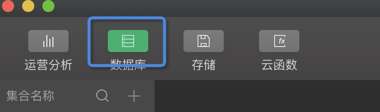

# 班费管理
## 如何运行
1. [安装node](https://nodejs.org/en/) 
2. [安装 yarn](https://yarnpkg.com/en/docs/install)
2. 安装 Taro CLI
```
yarn global add @tarojs/cli
```
3. 项目的 client 目录下, 执行
```
yarn install
yarn run build:weapp
```
4. [安装微信开发者工具](https://developers.weixin.qq.com/miniprogram/dev/devtools/download.html)
5. 导入项目(从根目录导入)
## 功能导览
### 完善信息
如果用户没有在系统中注册过,
用户需要填写姓名、学号以及选择班级来注册  


### 首页
- 用户缴纳总金额的显示
- 班级支出历史  
- 缴纳
- 支付  


#### 缴纳
缴纳的金额会反馈到 **总金额**  


#### 支出
支出需要权限, 用户如果没有权限将会提示 “支付功能需要权限”, 支出会反馈到 **班级支出历史** 和我的页面中的 **个人支出历史**  


#### 班级支出历史


### 我的
- 头像
- 用户信息
- 缴纳历史
- 支出历史
- 权限


#### 头像
头像是用户的微信头像
#### 用户信息
用户信息是用户注册时填写的信息
#### 缴纳历史


#### 支付历史


#### 权限
用于支出的权限解锁, 如果用户已经拥有权限将会提示 “您已经拥有权限”, 关于邀请码的生成和来源, 下面会讲  


## 数据库
点击开发者工具中的云开发  


选择其中的数据库  


共有5张表  


### classPay
其中记录的是所有班级支出历史, 不能手动操作
### classes
班级列表, 用于用户注册的时候选择班级, 手动添加, 需要字段(使用默认的id生成): 
- classid
- classname
### permissionCode
用户支出权限的邀请码, 手动添加, 用户使用后会删除, 需要字段(使用默认的id生成): 
- code
### personalPay
所有用户个人支出历史, 不能手动操作
### users
所有用户信息, 不能手动操作